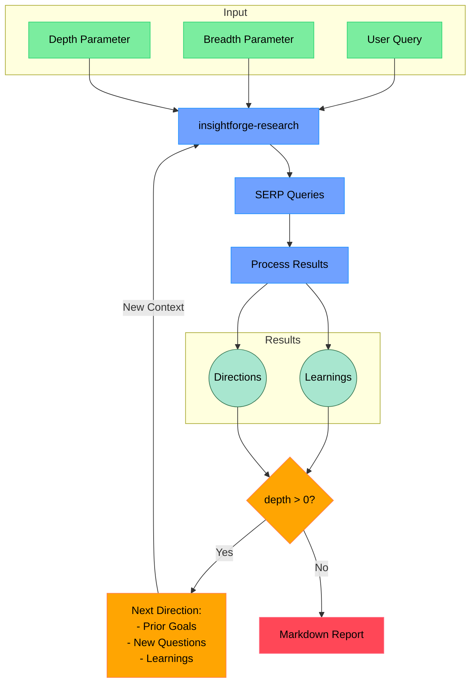

# insightforge-research

An AI-powered research assistant that performs iterative, deep research on any topic by combining search engines, web scraping, and large language models.

The goal is a compact deep research agent that refines its research direction over time and explores a topic in depth. The original implementation aims to stay under 500 lines of code so it is easy to understand and extend.

> **Attribution:** This README adapts the Open Deep Research project created by [Duet](https://duet.so). Its original author can be found on [X/Twitter](https://x.com/dzhng). The project display name here is **insightforge-research**; existing configuration names and runtime commands below retain their original values.

## How It Works



## Features

- **Iterative Research**: Generates search queries, processes results, and explores deeper based on findings.
- **Intelligent Query Generation**: Uses LLMs to generate targeted queries informed by research goals and previous findings.
- **Depth & Breadth Control**: Controls how widely and deeply the system researches.
- **Smart Follow-up**: Generates questions to clarify research needs.
- **Comprehensive Reports**: Produces Markdown reports with findings and sources.
- **Concurrent Processing**: Runs multiple searches and result-processing tasks in parallel.

## Requirements

- Node.js environment
- API keys for Firecrawl (web search and extraction) and OpenAI (`o3-mini`), unless configured to use a supported local or alternative model endpoint.

## Setup

### Node.js

1. Clone the repository.
2. Install dependencies:

   ```bash
   npm install
   ```

3. Add configuration to `.env.local`:

   ```bash
   FIRECRAWL_KEY="your_firecrawl_key"
   # If using a self-hosted Firecrawl instance:
   # FIRECRAWL_BASE_URL="http://localhost:3002"

   OPENAI_KEY="your_openai_key"
   ```

To use a local LLM, comment out `OPENAI_KEY` and configure `OPENAI_ENDPOINT` and `OPENAI_MODEL` instead:

- Set `OPENAI_ENDPOINT` to the address of your local server, for example `http://localhost:1234/v1`.
- Set `OPENAI_MODEL` to the loaded model's name.

### Docker

1. Clone the repository.
2. Rename `.env.example` to `.env.local` and set the API keys.
3. Build the Docker image using the repository's Dockerfile.
4. Start the services:

   ```bash
   docker compose up -d
   ```

5. Run the research command in the container:

   ```bash
   docker exec -it deep-research npm run docker
   ```

The `deep-research` name in the Docker command is the original container identifier. Adjust it only if your Docker Compose configuration uses a different name.

## Usage

Run the research assistant:

```bash
npm start
```

You will be prompted to:

1. Enter a research query.
2. Set research breadth (recommended: 3–10; default: 4).
3. Set research depth (recommended: 1–5; default: 2).
4. Answer follow-up questions to refine the direction.

The system generates and runs searches, analyzes results, recursively explores findings, and creates a Markdown report. Depending on the selected mode, it saves the report as `report.md` or `answer.md` in the working directory.

### Concurrency

With a paid or local Firecrawl instance, you can increase `CONCURRENCY_LIMIT` for faster processing. On the free plan, reduce it to `1` if rate-limit errors occur.

### DeepSeek R1

The original setup uses [Fireworks](http://fireworks.ai) for DeepSeek R1. Set its API key to select R1 instead of `o3-mini`:

```bash
FIREWORKS_KEY="api_key"
```

### Custom endpoints and models

Use these optional variables for an OpenAI-compatible API endpoint, such as OpenRouter or Gemini, and a custom model name:

```bash
OPENAI_ENDPOINT="custom_endpoint"
CUSTOM_MODEL="custom_model"
```

## Research Process

1. **Initial setup:** Accepts the query, breadth, and depth, then asks follow-up questions.
2. **Deep research:** Creates SERP queries, extracts key learnings, and proposes new research directions.
3. **Recursive exploration:** Continues while the depth budget remains, carrying goals and previous findings forward.
4. **Report generation:** Organizes findings, sources, and references into a readable Markdown report.

## Community Implementations

**Python:** [deep-research-python](https://github.com/Finance-LLMs/deep-research-python)

## License

MIT License — see the repository license for the applicable terms.
